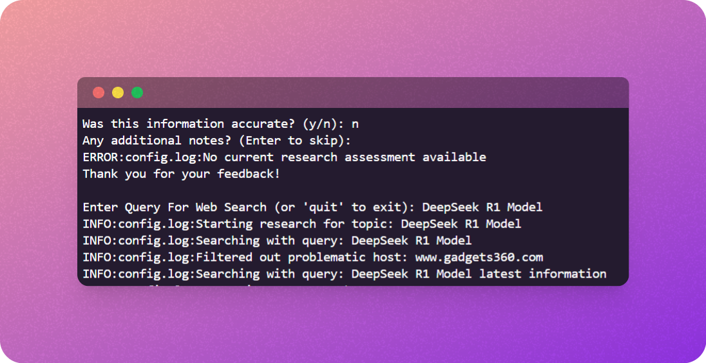

# 🌐 **SurfAgent: The Ultimate Web Search and Analysis Agent**

SurfAgent is a sophisticated **CLI-based agent**, meticulously crafted to revolutionize web searches. Powered by **Selenium** and **Brave Search**, SurfAgent extracts relevant information and even analyzes images related to your queries, leveraging state-of-the-art **Llama Vision Models**. These models are compatible with **GROQ** or **OLLAMA**, offering seamless integration.

---

## ✨ **Key Features**

### 📁 Contextual Memory
SurfAgent remembers and learns from past interactions, storing details in a dynamic memory system. Memory snapshots are available in a JSON format, providing insights like:
```json
{
    "query_types": "",
    "last_success": "",
    "last_failure": "",
    "total_attempts": "",
    "successful_attempts": "",
    "average_response_time": "",
    "notes": ""
}
```

### 🚫 Intelligent Host Management
SurfAgent keeps a record of problematic hosts in a `HOSTS.txt` file, ensuring those hosts are avoided in future searches.



### 🖼️ Image Analysis
Integrates advanced image processing capabilities by fetching relevant images based on user input or context, then passing these images to **Llama Vision Models**. These models analyze the images to extract key information, such as text, objects, patterns, or any visual data present, and process it to generate meaningful insights or responses.

### 🔗 LangChain Integration
Utilizes **LangChain tools** to enhance automation and analytical capabilities.

---

## 🚀 **How to Run SurfAgent**

To get started with SurfAgent, follow these simple steps:

### 🛠️ **Step 1: Install the Required Dependencies**

First, you'll need to install the required libraries. Open your terminal or command prompt and run the following command to install all dependencies:

```bash
pip install -r requirements.txt
```

This will install the necessary packages, including **Selenium**, **Brave Search**, **Llama Vision Models**, **LangChain**, and more.

### 🖥️ **Step 2: Run the SurfAgent**

Once the dependencies are installed, you're ready to run SurfAgent. Execute the following command to start the agent:

```bash
python main.py
```

SurfAgent will now initialize, begin processing web searches, and provide results based on your queries. Enjoy enhanced web search capabilities with intelligent memory, host management, and image analysis!

---

### 🧑‍💻 **Troubleshooting**

If you encounter any issues during installation or running, make sure:

- You're using a Python environment with the necessary permissions.
- All dependencies are properly installed by checking the **requirements.txt**.
- Open Issue in thr repo

---

That's it! You're all set to explore the powerful features of SurfAgent! 🌐🚀
